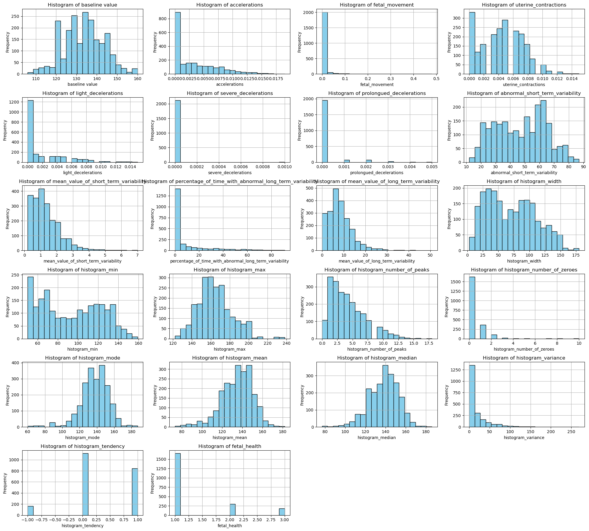
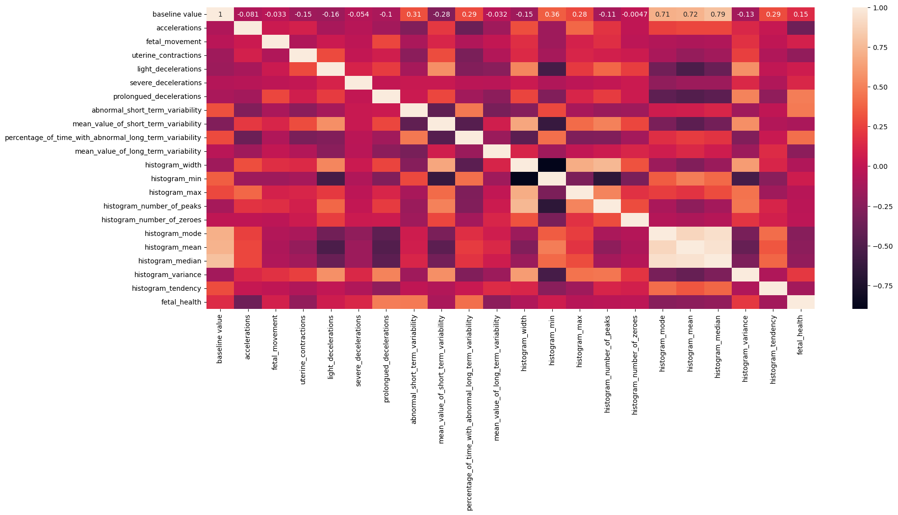
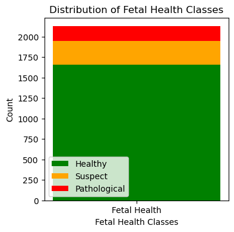
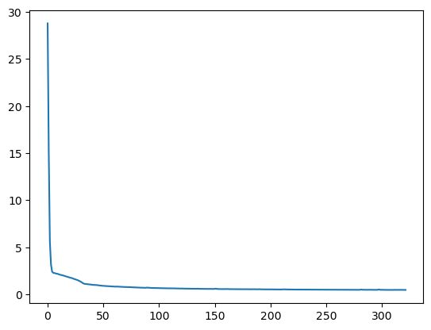
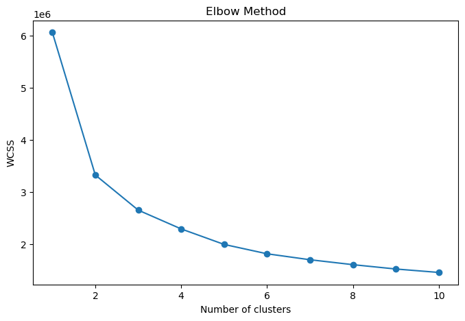
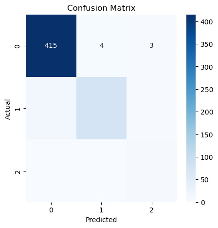

```python
import pandas as pd
import numpy as np
import seaborn as sns
import matplotlib.pyplot as plt
from scipy import stats
from sklearn.model_selection import train_test_split
from sklearn.svm import SVC
from sklearn.metrics import accuracy_score,confusion_matrix
from sklearn.neural_network import MLPClassifier
import tensorflow as tf
from tensorflow.keras.models import Sequential
from tensorflow.keras.layers import Dense, Conv1D, Flatten, MaxPooling1D
from tensorflow.keras.optimizers import Adam
from sklearn.preprocessing import StandardScaler
from sklearn.cluster import KMeans
from sklearn.cluster import AgglomerativeClustering
from sklearn.mixture import GaussianMixture
from xgboost import XGBClassifier
from sklearn.ensemble import RandomForestClassifier
from sklearn.model_selection import train_test_split, GridSearchCV
import warnings 
warnings.filterwarnings('ignore')
```


```python
data_file = pd.read_csv("D://Data Science/AI & Data mining/Coursework/archive (8)/fetal_health.csv")
```


```python
data_file.head()
```


<div>
<style scoped>
    .dataframe tbody tr th:only-of-type {
        vertical-align: middle;
    }

    .dataframe tbody tr th {
        vertical-align: top;
    }

    .dataframe thead th {
        text-align: right;
    }
</style>
<table border="1" class="dataframe">
  <thead>
    <tr style="text-align: right;">
      <th></th>
      <th>baseline value</th>
      <th>accelerations</th>
      <th>fetal_movement</th>
      <th>uterine_contractions</th>
      <th>light_decelerations</th>
      <th>severe_decelerations</th>
      <th>prolongued_decelerations</th>
      <th>abnormal_short_term_variability</th>
      <th>mean_value_of_short_term_variability</th>
      <th>percentage_of_time_with_abnormal_long_term_variability</th>
      <th>...</th>
      <th>histogram_min</th>
      <th>histogram_max</th>
      <th>histogram_number_of_peaks</th>
      <th>histogram_number_of_zeroes</th>
      <th>histogram_mode</th>
      <th>histogram_mean</th>
      <th>histogram_median</th>
      <th>histogram_variance</th>
      <th>histogram_tendency</th>
      <th>fetal_health</th>
    </tr>
  </thead>
  <tbody>
    <tr>
      <th>0</th>
      <td>120.0</td>
      <td>0.000</td>
      <td>0.0</td>
      <td>0.000</td>
      <td>0.000</td>
      <td>0.0</td>
      <td>0.0</td>
      <td>73.0</td>
      <td>0.5</td>
      <td>43.0</td>
      <td>...</td>
      <td>62.0</td>
      <td>126.0</td>
      <td>2.0</td>
      <td>0.0</td>
      <td>120.0</td>
      <td>137.0</td>
      <td>121.0</td>
      <td>73.0</td>
      <td>1.0</td>
      <td>2.0</td>
    </tr>
    <tr>
      <th>1</th>
      <td>132.0</td>
      <td>0.006</td>
      <td>0.0</td>
      <td>0.006</td>
      <td>0.003</td>
      <td>0.0</td>
      <td>0.0</td>
      <td>17.0</td>
      <td>2.1</td>
      <td>0.0</td>
      <td>...</td>
      <td>68.0</td>
      <td>198.0</td>
      <td>6.0</td>
      <td>1.0</td>
      <td>141.0</td>
      <td>136.0</td>
      <td>140.0</td>
      <td>12.0</td>
      <td>0.0</td>
      <td>1.0</td>
    </tr>
    <tr>
      <th>2</th>
      <td>133.0</td>
      <td>0.003</td>
      <td>0.0</td>
      <td>0.008</td>
      <td>0.003</td>
      <td>0.0</td>
      <td>0.0</td>
      <td>16.0</td>
      <td>2.1</td>
      <td>0.0</td>
      <td>...</td>
      <td>68.0</td>
      <td>198.0</td>
      <td>5.0</td>
      <td>1.0</td>
      <td>141.0</td>
      <td>135.0</td>
      <td>138.0</td>
      <td>13.0</td>
      <td>0.0</td>
      <td>1.0</td>
    </tr>
    <tr>
      <th>3</th>
      <td>134.0</td>
      <td>0.003</td>
      <td>0.0</td>
      <td>0.008</td>
      <td>0.003</td>
      <td>0.0</td>
      <td>0.0</td>
      <td>16.0</td>
      <td>2.4</td>
      <td>0.0</td>
      <td>...</td>
      <td>53.0</td>
      <td>170.0</td>
      <td>11.0</td>
      <td>0.0</td>
      <td>137.0</td>
      <td>134.0</td>
      <td>137.0</td>
      <td>13.0</td>
      <td>1.0</td>
      <td>1.0</td>
    </tr>
    <tr>
      <th>4</th>
      <td>132.0</td>
      <td>0.007</td>
      <td>0.0</td>
      <td>0.008</td>
      <td>0.000</td>
      <td>0.0</td>
      <td>0.0</td>
      <td>16.0</td>
      <td>2.4</td>
      <td>0.0</td>
      <td>...</td>
      <td>53.0</td>
      <td>170.0</td>
      <td>9.0</td>
      <td>0.0</td>
      <td>137.0</td>
      <td>136.0</td>
      <td>138.0</td>
      <td>11.0</td>
      <td>1.0</td>
      <td>1.0</td>
    </tr>
  </tbody>
</table>
<p>5 rows × 22 columns</p>
</div>


```python
data_file.shape
```


    (2126, 22)


```python
data_file.info()
```

    <class 'pandas.core.frame.DataFrame'>
    RangeIndex: 2126 entries, 0 to 2125
    Data columns (total 22 columns):
     #   Column                                                  Non-Null Count  Dtype  
    ---  ------                                                  --------------  -----  
     0   baseline value                                          2126 non-null   float64
     1   accelerations                                           2126 non-null   float64
     2   fetal_movement                                          2126 non-null   float64
     3   uterine_contractions                                    2126 non-null   float64
     4   light_decelerations                                     2126 non-null   float64
     5   severe_decelerations                                    2126 non-null   float64
     6   prolongued_decelerations                                2126 non-null   float64
     7   abnormal_short_term_variability                         2126 non-null   float64
     8   mean_value_of_short_term_variability                    2126 non-null   float64
     9   percentage_of_time_with_abnormal_long_term_variability  2126 non-null   float64
     10  mean_value_of_long_term_variability                     2126 non-null   float64
     11  histogram_width                                         2126 non-null   float64
     12  histogram_min                                           2126 non-null   float64
     13  histogram_max                                           2126 non-null   float64
     14  histogram_number_of_peaks                               2126 non-null   float64
     15  histogram_number_of_zeroes                              2126 non-null   float64
     16  histogram_mode                                          2126 non-null   float64
     17  histogram_mean                                          2126 non-null   float64
     18  histogram_median                                        2126 non-null   float64
     19  histogram_variance                                      2126 non-null   float64
     20  histogram_tendency                                      2126 non-null   float64
     21  fetal_health                                            2126 non-null   float64
    dtypes: float64(22)
    memory usage: 365.5 KB
    


```python
data_file.describe()
```


<div>
<style scoped>
    .dataframe tbody tr th:only-of-type {
        vertical-align: middle;
    }

    .dataframe tbody tr th {
        vertical-align: top;
    }

    .dataframe thead th {
        text-align: right;
    }
</style>
<table border="1" class="dataframe">
  <thead>
    <tr style="text-align: right;">
      <th></th>
      <th>baseline value</th>
      <th>accelerations</th>
      <th>fetal_movement</th>
      <th>uterine_contractions</th>
      <th>light_decelerations</th>
      <th>severe_decelerations</th>
      <th>prolongued_decelerations</th>
      <th>abnormal_short_term_variability</th>
      <th>mean_value_of_short_term_variability</th>
      <th>percentage_of_time_with_abnormal_long_term_variability</th>
      <th>...</th>
      <th>histogram_min</th>
      <th>histogram_max</th>
      <th>histogram_number_of_peaks</th>
      <th>histogram_number_of_zeroes</th>
      <th>histogram_mode</th>
      <th>histogram_mean</th>
      <th>histogram_median</th>
      <th>histogram_variance</th>
      <th>histogram_tendency</th>
      <th>fetal_health</th>
    </tr>
  </thead>
  <tbody>
    <tr>
      <th>count</th>
      <td>2126.000000</td>
      <td>2126.000000</td>
      <td>2126.000000</td>
      <td>2126.000000</td>
      <td>2126.000000</td>
      <td>2126.000000</td>
      <td>2126.000000</td>
      <td>2126.000000</td>
      <td>2126.000000</td>
      <td>2126.00000</td>
      <td>...</td>
      <td>2126.000000</td>
      <td>2126.000000</td>
      <td>2126.000000</td>
      <td>2126.000000</td>
      <td>2126.000000</td>
      <td>2126.000000</td>
      <td>2126.000000</td>
      <td>2126.000000</td>
      <td>2126.000000</td>
      <td>2126.000000</td>
    </tr>
    <tr>
      <th>mean</th>
      <td>133.303857</td>
      <td>0.003178</td>
      <td>0.009481</td>
      <td>0.004366</td>
      <td>0.001889</td>
      <td>0.000003</td>
      <td>0.000159</td>
      <td>46.990122</td>
      <td>1.332785</td>
      <td>9.84666</td>
      <td>...</td>
      <td>93.579492</td>
      <td>164.025400</td>
      <td>4.068203</td>
      <td>0.323612</td>
      <td>137.452023</td>
      <td>134.610536</td>
      <td>138.090310</td>
      <td>18.808090</td>
      <td>0.320320</td>
      <td>1.304327</td>
    </tr>
    <tr>
      <th>std</th>
      <td>9.840844</td>
      <td>0.003866</td>
      <td>0.046666</td>
      <td>0.002946</td>
      <td>0.002960</td>
      <td>0.000057</td>
      <td>0.000590</td>
      <td>17.192814</td>
      <td>0.883241</td>
      <td>18.39688</td>
      <td>...</td>
      <td>29.560212</td>
      <td>17.944183</td>
      <td>2.949386</td>
      <td>0.706059</td>
      <td>16.381289</td>
      <td>15.593596</td>
      <td>14.466589</td>
      <td>28.977636</td>
      <td>0.610829</td>
      <td>0.614377</td>
    </tr>
    <tr>
      <th>min</th>
      <td>106.000000</td>
      <td>0.000000</td>
      <td>0.000000</td>
      <td>0.000000</td>
      <td>0.000000</td>
      <td>0.000000</td>
      <td>0.000000</td>
      <td>12.000000</td>
      <td>0.200000</td>
      <td>0.00000</td>
      <td>...</td>
      <td>50.000000</td>
      <td>122.000000</td>
      <td>0.000000</td>
      <td>0.000000</td>
      <td>60.000000</td>
      <td>73.000000</td>
      <td>77.000000</td>
      <td>0.000000</td>
      <td>-1.000000</td>
      <td>1.000000</td>
    </tr>
    <tr>
      <th>25%</th>
      <td>126.000000</td>
      <td>0.000000</td>
      <td>0.000000</td>
      <td>0.002000</td>
      <td>0.000000</td>
      <td>0.000000</td>
      <td>0.000000</td>
      <td>32.000000</td>
      <td>0.700000</td>
      <td>0.00000</td>
      <td>...</td>
      <td>67.000000</td>
      <td>152.000000</td>
      <td>2.000000</td>
      <td>0.000000</td>
      <td>129.000000</td>
      <td>125.000000</td>
      <td>129.000000</td>
      <td>2.000000</td>
      <td>0.000000</td>
      <td>1.000000</td>
    </tr>
    <tr>
      <th>50%</th>
      <td>133.000000</td>
      <td>0.002000</td>
      <td>0.000000</td>
      <td>0.004000</td>
      <td>0.000000</td>
      <td>0.000000</td>
      <td>0.000000</td>
      <td>49.000000</td>
      <td>1.200000</td>
      <td>0.00000</td>
      <td>...</td>
      <td>93.000000</td>
      <td>162.000000</td>
      <td>3.000000</td>
      <td>0.000000</td>
      <td>139.000000</td>
      <td>136.000000</td>
      <td>139.000000</td>
      <td>7.000000</td>
      <td>0.000000</td>
      <td>1.000000</td>
    </tr>
    <tr>
      <th>75%</th>
      <td>140.000000</td>
      <td>0.006000</td>
      <td>0.003000</td>
      <td>0.007000</td>
      <td>0.003000</td>
      <td>0.000000</td>
      <td>0.000000</td>
      <td>61.000000</td>
      <td>1.700000</td>
      <td>11.00000</td>
      <td>...</td>
      <td>120.000000</td>
      <td>174.000000</td>
      <td>6.000000</td>
      <td>0.000000</td>
      <td>148.000000</td>
      <td>145.000000</td>
      <td>148.000000</td>
      <td>24.000000</td>
      <td>1.000000</td>
      <td>1.000000</td>
    </tr>
    <tr>
      <th>max</th>
      <td>160.000000</td>
      <td>0.019000</td>
      <td>0.481000</td>
      <td>0.015000</td>
      <td>0.015000</td>
      <td>0.001000</td>
      <td>0.005000</td>
      <td>87.000000</td>
      <td>7.000000</td>
      <td>91.00000</td>
      <td>...</td>
      <td>159.000000</td>
      <td>238.000000</td>
      <td>18.000000</td>
      <td>10.000000</td>
      <td>187.000000</td>
      <td>182.000000</td>
      <td>186.000000</td>
      <td>269.000000</td>
      <td>1.000000</td>
      <td>3.000000</td>
    </tr>
  </tbody>
</table>
<p>8 rows × 22 columns</p>
</div>


```python
# Select numerical columns
numerical_columns = data_file.select_dtypes(include=['float64'])

num_cols = 4

num_rows = (len(numerical_columns.columns) + num_cols - 1) // num_cols

fig, axes = plt.subplots(num_rows, num_cols, figsize=(20, num_rows * 3))

axes = axes.flatten()

for idx, column in enumerate(numerical_columns.columns):
    axes[idx].hist(data_file[column], bins=20, color='skyblue', edgecolor='black')
    axes[idx].set_title(f'Histogram of {column}')
    axes[idx].set_xlabel(column)
    axes[idx].set_ylabel('Frequency')
    axes[idx].grid(True)

for ax in axes[len(numerical_columns.columns):]:
    fig.delaxes(ax)

fig.tight_layout()

plt.show()

```


    

    


```python
# Correlation matrix
plt.figure(figsize=(20, 8))
sns.heatmap(data_file.corr(), annot=True)
plt.show()
```


    

    


```python

# Count occurrences of each class in the 'fetal_health' variable
class_counts = data_file['fetal_health'].value_counts().sort_index()

plt.figure(figsize=(4, 4))
plt.bar(x='Fetal Health', height=class_counts[1], color='green', label='Healthy')
plt.bar(x='Fetal Health', height=class_counts[2], color='orange', bottom=class_counts[1], label='Suspect')
plt.bar(x='Fetal Health', height=class_counts[3], color='red', bottom=class_counts[1] + class_counts[2], label='Pathological')
plt.xlabel('Fetal Health Classes')
plt.ylabel('Count')
plt.title('Distribution of Fetal Health Classes')
plt.legend()
plt.show()

```


    

    


```python
data_file.info()
```

    <class 'pandas.core.frame.DataFrame'>
    RangeIndex: 2126 entries, 0 to 2125
    Data columns (total 22 columns):
     #   Column                                                  Non-Null Count  Dtype  
    ---  ------                                                  --------------  -----  
     0   baseline value                                          2126 non-null   float64
     1   accelerations                                           2126 non-null   float64
     2   fetal_movement                                          2126 non-null   float64
     3   uterine_contractions                                    2126 non-null   float64
     4   light_decelerations                                     2126 non-null   float64
     5   severe_decelerations                                    2126 non-null   float64
     6   prolongued_decelerations                                2126 non-null   float64
     7   abnormal_short_term_variability                         2126 non-null   float64
     8   mean_value_of_short_term_variability                    2126 non-null   float64
     9   percentage_of_time_with_abnormal_long_term_variability  2126 non-null   float64
     10  mean_value_of_long_term_variability                     2126 non-null   float64
     11  histogram_width                                         2126 non-null   float64
     12  histogram_min                                           2126 non-null   float64
     13  histogram_max                                           2126 non-null   float64
     14  histogram_number_of_peaks                               2126 non-null   float64
     15  histogram_number_of_zeroes                              2126 non-null   float64
     16  histogram_mode                                          2126 non-null   float64
     17  histogram_mean                                          2126 non-null   float64
     18  histogram_median                                        2126 non-null   float64
     19  histogram_variance                                      2126 non-null   float64
     20  histogram_tendency                                      2126 non-null   float64
     21  fetal_health                                            2126 non-null   float64
    dtypes: float64(22)
    memory usage: 365.5 KB
    


```python
missing_values = data_file.isnull().sum()
```


```python
# check for missing values
```


```python
print(missing_values)
```

    baseline value                                            0
    accelerations                                             0
    fetal_movement                                            0
    uterine_contractions                                      0
    light_decelerations                                       0
    severe_decelerations                                      0
    prolongued_decelerations                                  0
    abnormal_short_term_variability                           0
    mean_value_of_short_term_variability                      0
    percentage_of_time_with_abnormal_long_term_variability    0
    mean_value_of_long_term_variability                       0
    histogram_width                                           0
    histogram_min                                             0
    histogram_max                                             0
    histogram_number_of_peaks                                 0
    histogram_number_of_zeroes                                0
    histogram_mode                                            0
    histogram_mean                                            0
    histogram_median                                          0
    histogram_variance                                        0
    histogram_tendency                                        0
    fetal_health                                              0
    dtype: int64
    


```python
# Handling outliers
```


```python
exclude_column = 'fetal_health'
selected_columns = data_file.drop(columns = [exclude_column])
print(selected_columns.info())
```

    <class 'pandas.core.frame.DataFrame'>
    RangeIndex: 2126 entries, 0 to 2125
    Data columns (total 21 columns):
     #   Column                                                  Non-Null Count  Dtype  
    ---  ------                                                  --------------  -----  
     0   baseline value                                          2126 non-null   float64
     1   accelerations                                           2126 non-null   float64
     2   fetal_movement                                          2126 non-null   float64
     3   uterine_contractions                                    2126 non-null   float64
     4   light_decelerations                                     2126 non-null   float64
     5   severe_decelerations                                    2126 non-null   float64
     6   prolongued_decelerations                                2126 non-null   float64
     7   abnormal_short_term_variability                         2126 non-null   float64
     8   mean_value_of_short_term_variability                    2126 non-null   float64
     9   percentage_of_time_with_abnormal_long_term_variability  2126 non-null   float64
     10  mean_value_of_long_term_variability                     2126 non-null   float64
     11  histogram_width                                         2126 non-null   float64
     12  histogram_min                                           2126 non-null   float64
     13  histogram_max                                           2126 non-null   float64
     14  histogram_number_of_peaks                               2126 non-null   float64
     15  histogram_number_of_zeroes                              2126 non-null   float64
     16  histogram_mode                                          2126 non-null   float64
     17  histogram_mean                                          2126 non-null   float64
     18  histogram_median                                        2126 non-null   float64
     19  histogram_variance                                      2126 non-null   float64
     20  histogram_tendency                                      2126 non-null   float64
    dtypes: float64(21)
    memory usage: 348.9 KB
    None
    


```python
# Checking outliers
outliers_list = []

for column in selected_columns:
    z_scores = np.abs(stats.zscore(data_file[column]))
    check_outliers = (z_scores > 3)

    outliers_count = 0
    for i in check_outliers:
        if i == True:
            outliers_count = outliers_count+1
    outliers_list.append(outliers_count)
print(outliers_list)
# We see that there are quite a number of outliers in each column
```

    [0, 23, 31, 3, 43, 7, 108, 0, 33, 59, 33, 0, 0, 14, 19, 28, 39, 26, 16, 44, 0]
    


```python
# Dropping outliers
for column in selected_columns:
    z_scores = np.abs(stats.zscore(data_file[column]))
    outliers = (z_scores > 3)
    data_file = data_file[~outliers]
```

#Scaling the dataset
data_file['fetal_health'] = data_file['fetal_health'].astype('int32')


```python
data_file.shape
```


    (1719, 22)


```python
data_file.info()

```

    <class 'pandas.core.frame.DataFrame'>
    Index: 1719 entries, 1 to 2125
    Data columns (total 22 columns):
     #   Column                                                  Non-Null Count  Dtype  
    ---  ------                                                  --------------  -----  
     0   baseline value                                          1719 non-null   float64
     1   accelerations                                           1719 non-null   float64
     2   fetal_movement                                          1719 non-null   float64
     3   uterine_contractions                                    1719 non-null   float64
     4   light_decelerations                                     1719 non-null   float64
     5   severe_decelerations                                    1719 non-null   float64
     6   prolongued_decelerations                                1719 non-null   float64
     7   abnormal_short_term_variability                         1719 non-null   float64
     8   mean_value_of_short_term_variability                    1719 non-null   float64
     9   percentage_of_time_with_abnormal_long_term_variability  1719 non-null   float64
     10  mean_value_of_long_term_variability                     1719 non-null   float64
     11  histogram_width                                         1719 non-null   float64
     12  histogram_min                                           1719 non-null   float64
     13  histogram_max                                           1719 non-null   float64
     14  histogram_number_of_peaks                               1719 non-null   float64
     15  histogram_number_of_zeroes                              1719 non-null   float64
     16  histogram_mode                                          1719 non-null   float64
     17  histogram_mean                                          1719 non-null   float64
     18  histogram_median                                        1719 non-null   float64
     19  histogram_variance                                      1719 non-null   float64
     20  histogram_tendency                                      1719 non-null   float64
     21  fetal_health                                            1719 non-null   float64
    dtypes: float64(22)
    memory usage: 308.9 KB
    


```python
# Feature mapping

# Create the 'health_status' variable based on 'fetal_health'
data_file['health_status'] = data_file['fetal_health'].map({
    1: 'Normal',
    2: 'Suspect',
    3: 'Pathological'
})

# Verify the changes
print(data_file[['fetal_health', 'health_status']].head())


```

       fetal_health health_status
    1           1.0        Normal
    2           1.0        Normal
    3           1.0        Normal
    4           1.0        Normal
    7           3.0  Pathological
    


```python
#We Extract a copy of the preprocessed file to upload into Azure Automated ML service to run the classification algorithm 
data_file.to_csv('D://Data Science/AI & Data mining/file.csv', index=False)
```


```python
data_file = data_file.drop('health_status',axis =1)
```


```python
data_file.head()
```


<div>
<style scoped>
    .dataframe tbody tr th:only-of-type {
        vertical-align: middle;
    }

    .dataframe tbody tr th {
        vertical-align: top;
    }

    .dataframe thead th {
        text-align: right;
    }
</style>
<table border="1" class="dataframe">
  <thead>
    <tr style="text-align: right;">
      <th></th>
      <th>baseline value</th>
      <th>accelerations</th>
      <th>fetal_movement</th>
      <th>uterine_contractions</th>
      <th>light_decelerations</th>
      <th>severe_decelerations</th>
      <th>prolongued_decelerations</th>
      <th>abnormal_short_term_variability</th>
      <th>mean_value_of_short_term_variability</th>
      <th>percentage_of_time_with_abnormal_long_term_variability</th>
      <th>...</th>
      <th>histogram_min</th>
      <th>histogram_max</th>
      <th>histogram_number_of_peaks</th>
      <th>histogram_number_of_zeroes</th>
      <th>histogram_mode</th>
      <th>histogram_mean</th>
      <th>histogram_median</th>
      <th>histogram_variance</th>
      <th>histogram_tendency</th>
      <th>fetal_health</th>
    </tr>
  </thead>
  <tbody>
    <tr>
      <th>1</th>
      <td>132.0</td>
      <td>0.006</td>
      <td>0.0</td>
      <td>0.006</td>
      <td>0.003</td>
      <td>0.0</td>
      <td>0.0</td>
      <td>17.0</td>
      <td>2.1</td>
      <td>0.0</td>
      <td>...</td>
      <td>68.0</td>
      <td>198.0</td>
      <td>6.0</td>
      <td>1.0</td>
      <td>141.0</td>
      <td>136.0</td>
      <td>140.0</td>
      <td>12.0</td>
      <td>0.0</td>
      <td>1.0</td>
    </tr>
    <tr>
      <th>2</th>
      <td>133.0</td>
      <td>0.003</td>
      <td>0.0</td>
      <td>0.008</td>
      <td>0.003</td>
      <td>0.0</td>
      <td>0.0</td>
      <td>16.0</td>
      <td>2.1</td>
      <td>0.0</td>
      <td>...</td>
      <td>68.0</td>
      <td>198.0</td>
      <td>5.0</td>
      <td>1.0</td>
      <td>141.0</td>
      <td>135.0</td>
      <td>138.0</td>
      <td>13.0</td>
      <td>0.0</td>
      <td>1.0</td>
    </tr>
    <tr>
      <th>3</th>
      <td>134.0</td>
      <td>0.003</td>
      <td>0.0</td>
      <td>0.008</td>
      <td>0.003</td>
      <td>0.0</td>
      <td>0.0</td>
      <td>16.0</td>
      <td>2.4</td>
      <td>0.0</td>
      <td>...</td>
      <td>53.0</td>
      <td>170.0</td>
      <td>11.0</td>
      <td>0.0</td>
      <td>137.0</td>
      <td>134.0</td>
      <td>137.0</td>
      <td>13.0</td>
      <td>1.0</td>
      <td>1.0</td>
    </tr>
    <tr>
      <th>4</th>
      <td>132.0</td>
      <td>0.007</td>
      <td>0.0</td>
      <td>0.008</td>
      <td>0.000</td>
      <td>0.0</td>
      <td>0.0</td>
      <td>16.0</td>
      <td>2.4</td>
      <td>0.0</td>
      <td>...</td>
      <td>53.0</td>
      <td>170.0</td>
      <td>9.0</td>
      <td>0.0</td>
      <td>137.0</td>
      <td>136.0</td>
      <td>138.0</td>
      <td>11.0</td>
      <td>1.0</td>
      <td>1.0</td>
    </tr>
    <tr>
      <th>7</th>
      <td>122.0</td>
      <td>0.000</td>
      <td>0.0</td>
      <td>0.000</td>
      <td>0.000</td>
      <td>0.0</td>
      <td>0.0</td>
      <td>83.0</td>
      <td>0.5</td>
      <td>6.0</td>
      <td>...</td>
      <td>62.0</td>
      <td>130.0</td>
      <td>0.0</td>
      <td>0.0</td>
      <td>122.0</td>
      <td>122.0</td>
      <td>123.0</td>
      <td>3.0</td>
      <td>1.0</td>
      <td>3.0</td>
    </tr>
  </tbody>
</table>
<p>5 rows × 22 columns</p>
</div>


```python
# Separate features (X) and target variable (y)
X = data_file.drop(columns=['fetal_health'])
y = data_file['fetal_health']
```


```python
# Split the data into training and testing sets
X_train, X_test, y_train, y_test = train_test_split(X, y, test_size=0.3, random_state=62)
```

# Task 1 - Support Vector Machines


```python
## SVM
svm_classifier = SVC(kernel='rbf', C=3.0, gamma= 'scale')
svm_classifier.fit(X_train, y_train)
```


<style>#sk-container-id-1 {color: black;background-color: white;}#sk-container-id-1 pre{padding: 0;}#sk-container-id-1 div.sk-toggleable {background-color: white;}#sk-container-id-1 label.sk-toggleable__label {cursor: pointer;display: block;width: 100%;margin-bottom: 0;padding: 0.3em;box-sizing: border-box;text-align: center;}#sk-container-id-1 label.sk-toggleable__label-arrow:before {content: "▸";float: left;margin-right: 0.25em;color: #696969;}#sk-container-id-1 label.sk-toggleable__label-arrow:hover:before {color: black;}#sk-container-id-1 div.sk-estimator:hover label.sk-toggleable__label-arrow:before {color: black;}#sk-container-id-1 div.sk-toggleable__content {max-height: 0;max-width: 0;overflow: hidden;text-align: left;background-color: #f0f8ff;}#sk-container-id-1 div.sk-toggleable__content pre {margin: 0.2em;color: black;border-radius: 0.25em;background-color: #f0f8ff;}#sk-container-id-1 input.sk-toggleable__control:checked~div.sk-toggleable__content {max-height: 200px;max-width: 100%;overflow: auto;}#sk-container-id-1 input.sk-toggleable__control:checked~label.sk-toggleable__label-arrow:before {content: "▾";}#sk-container-id-1 div.sk-estimator input.sk-toggleable__control:checked~label.sk-toggleable__label {background-color: #d4ebff;}#sk-container-id-1 div.sk-label input.sk-toggleable__control:checked~label.sk-toggleable__label {background-color: #d4ebff;}#sk-container-id-1 input.sk-hidden--visually {border: 0;clip: rect(1px 1px 1px 1px);clip: rect(1px, 1px, 1px, 1px);height: 1px;margin: -1px;overflow: hidden;padding: 0;position: absolute;width: 1px;}#sk-container-id-1 div.sk-estimator {font-family: monospace;background-color: #f0f8ff;border: 1px dotted black;border-radius: 0.25em;box-sizing: border-box;margin-bottom: 0.5em;}#sk-container-id-1 div.sk-estimator:hover {background-color: #d4ebff;}#sk-container-id-1 div.sk-parallel-item::after {content: "";width: 100%;border-bottom: 1px solid gray;flex-grow: 1;}#sk-container-id-1 div.sk-label:hover label.sk-toggleable__label {background-color: #d4ebff;}#sk-container-id-1 div.sk-serial::before {content: "";position: absolute;border-left: 1px solid gray;box-sizing: border-box;top: 0;bottom: 0;left: 50%;z-index: 0;}#sk-container-id-1 div.sk-serial {display: flex;flex-direction: column;align-items: center;background-color: white;padding-right: 0.2em;padding-left: 0.2em;position: relative;}#sk-container-id-1 div.sk-item {position: relative;z-index: 1;}#sk-container-id-1 div.sk-parallel {display: flex;align-items: stretch;justify-content: center;background-color: white;position: relative;}#sk-container-id-1 div.sk-item::before, #sk-container-id-1 div.sk-parallel-item::before {content: "";position: absolute;border-left: 1px solid gray;box-sizing: border-box;top: 0;bottom: 0;left: 50%;z-index: -1;}#sk-container-id-1 div.sk-parallel-item {display: flex;flex-direction: column;z-index: 1;position: relative;background-color: white;}#sk-container-id-1 div.sk-parallel-item:first-child::after {align-self: flex-end;width: 50%;}#sk-container-id-1 div.sk-parallel-item:last-child::after {align-self: flex-start;width: 50%;}#sk-container-id-1 div.sk-parallel-item:only-child::after {width: 0;}#sk-container-id-1 div.sk-dashed-wrapped {border: 1px dashed gray;margin: 0 0.4em 0.5em 0.4em;box-sizing: border-box;padding-bottom: 0.4em;background-color: white;}#sk-container-id-1 div.sk-label label {font-family: monospace;font-weight: bold;display: inline-block;line-height: 1.2em;}#sk-container-id-1 div.sk-label-container {text-align: center;}#sk-container-id-1 div.sk-container {/* jupyter's `normalize.less` sets `[hidden] { display: none; }` but bootstrap.min.css set `[hidden] { display: none !important; }` so we also need the `!important` here to be able to override the default hidden behavior on the sphinx rendered scikit-learn.org. See: https://github.com/scikit-learn/scikit-learn/issues/21755 */display: inline-block !important;position: relative;}#sk-container-id-1 div.sk-text-repr-fallback {display: none;}</style><div id="sk-container-id-1" class="sk-top-container"><div class="sk-text-repr-fallback"><pre>SVC(C=3.0)</pre><b>In a Jupyter environment, please rerun this cell to show the HTML representation or trust the notebook. <br />On GitHub, the HTML representation is unable to render, please try loading this page with nbviewer.org.</b></div><div class="sk-container" hidden><div class="sk-item"><div class="sk-estimator sk-toggleable"><input class="sk-toggleable__control sk-hidden--visually" id="sk-estimator-id-1" type="checkbox" checked><label for="sk-estimator-id-1" class="sk-toggleable__label sk-toggleable__label-arrow">SVC</label><div class="sk-toggleable__content"><pre>SVC(C=3.0)</pre></div></div></div></div></div>


```python
# Predict the labels for the test set
y_pred = svm_classifier.predict(X_test)
```


```python
# Calculate accuracy
accuracy = accuracy_score(y_test, y_pred)

# Report the accuracy
print("Accuracy of the SVM classifier:", accuracy)
```

    Accuracy of the SVM classifier: 0.8856589147286822
    

# Task 2 - Multilayer Perceptron


```python
#MLP classifier
mlp_classifier = MLPClassifier(hidden_layer_sizes=(25, 18, 10, 5), activation='relu', solver='adam', alpha=5.0,
                               batch_size='auto', learning_rate='constant', learning_rate_init=0.001, max_iter=600,
                               shuffle=True, random_state=32)
```


```python
# Training the classifier
mlp_classifier.fit(X_train, y_train)
```


<style>#sk-container-id-2 {color: black;background-color: white;}#sk-container-id-2 pre{padding: 0;}#sk-container-id-2 div.sk-toggleable {background-color: white;}#sk-container-id-2 label.sk-toggleable__label {cursor: pointer;display: block;width: 100%;margin-bottom: 0;padding: 0.3em;box-sizing: border-box;text-align: center;}#sk-container-id-2 label.sk-toggleable__label-arrow:before {content: "▸";float: left;margin-right: 0.25em;color: #696969;}#sk-container-id-2 label.sk-toggleable__label-arrow:hover:before {color: black;}#sk-container-id-2 div.sk-estimator:hover label.sk-toggleable__label-arrow:before {color: black;}#sk-container-id-2 div.sk-toggleable__content {max-height: 0;max-width: 0;overflow: hidden;text-align: left;background-color: #f0f8ff;}#sk-container-id-2 div.sk-toggleable__content pre {margin: 0.2em;color: black;border-radius: 0.25em;background-color: #f0f8ff;}#sk-container-id-2 input.sk-toggleable__control:checked~div.sk-toggleable__content {max-height: 200px;max-width: 100%;overflow: auto;}#sk-container-id-2 input.sk-toggleable__control:checked~label.sk-toggleable__label-arrow:before {content: "▾";}#sk-container-id-2 div.sk-estimator input.sk-toggleable__control:checked~label.sk-toggleable__label {background-color: #d4ebff;}#sk-container-id-2 div.sk-label input.sk-toggleable__control:checked~label.sk-toggleable__label {background-color: #d4ebff;}#sk-container-id-2 input.sk-hidden--visually {border: 0;clip: rect(1px 1px 1px 1px);clip: rect(1px, 1px, 1px, 1px);height: 1px;margin: -1px;overflow: hidden;padding: 0;position: absolute;width: 1px;}#sk-container-id-2 div.sk-estimator {font-family: monospace;background-color: #f0f8ff;border: 1px dotted black;border-radius: 0.25em;box-sizing: border-box;margin-bottom: 0.5em;}#sk-container-id-2 div.sk-estimator:hover {background-color: #d4ebff;}#sk-container-id-2 div.sk-parallel-item::after {content: "";width: 100%;border-bottom: 1px solid gray;flex-grow: 1;}#sk-container-id-2 div.sk-label:hover label.sk-toggleable__label {background-color: #d4ebff;}#sk-container-id-2 div.sk-serial::before {content: "";position: absolute;border-left: 1px solid gray;box-sizing: border-box;top: 0;bottom: 0;left: 50%;z-index: 0;}#sk-container-id-2 div.sk-serial {display: flex;flex-direction: column;align-items: center;background-color: white;padding-right: 0.2em;padding-left: 0.2em;position: relative;}#sk-container-id-2 div.sk-item {position: relative;z-index: 1;}#sk-container-id-2 div.sk-parallel {display: flex;align-items: stretch;justify-content: center;background-color: white;position: relative;}#sk-container-id-2 div.sk-item::before, #sk-container-id-2 div.sk-parallel-item::before {content: "";position: absolute;border-left: 1px solid gray;box-sizing: border-box;top: 0;bottom: 0;left: 50%;z-index: -1;}#sk-container-id-2 div.sk-parallel-item {display: flex;flex-direction: column;z-index: 1;position: relative;background-color: white;}#sk-container-id-2 div.sk-parallel-item:first-child::after {align-self: flex-end;width: 50%;}#sk-container-id-2 div.sk-parallel-item:last-child::after {align-self: flex-start;width: 50%;}#sk-container-id-2 div.sk-parallel-item:only-child::after {width: 0;}#sk-container-id-2 div.sk-dashed-wrapped {border: 1px dashed gray;margin: 0 0.4em 0.5em 0.4em;box-sizing: border-box;padding-bottom: 0.4em;background-color: white;}#sk-container-id-2 div.sk-label label {font-family: monospace;font-weight: bold;display: inline-block;line-height: 1.2em;}#sk-container-id-2 div.sk-label-container {text-align: center;}#sk-container-id-2 div.sk-container {/* jupyter's `normalize.less` sets `[hidden] { display: none; }` but bootstrap.min.css set `[hidden] { display: none !important; }` so we also need the `!important` here to be able to override the default hidden behavior on the sphinx rendered scikit-learn.org. See: https://github.com/scikit-learn/scikit-learn/issues/21755 */display: inline-block !important;position: relative;}#sk-container-id-2 div.sk-text-repr-fallback {display: none;}</style><div id="sk-container-id-2" class="sk-top-container"><div class="sk-text-repr-fallback"><pre>MLPClassifier(alpha=5.0, hidden_layer_sizes=(25, 18, 10, 5), max_iter=600,
              random_state=32)</pre><b>In a Jupyter environment, please rerun this cell to show the HTML representation or trust the notebook. <br />On GitHub, the HTML representation is unable to render, please try loading this page with nbviewer.org.</b></div><div class="sk-container" hidden><div class="sk-item"><div class="sk-estimator sk-toggleable"><input class="sk-toggleable__control sk-hidden--visually" id="sk-estimator-id-2" type="checkbox" checked><label for="sk-estimator-id-2" class="sk-toggleable__label sk-toggleable__label-arrow">MLPClassifier</label><div class="sk-toggleable__content"><pre>MLPClassifier(alpha=5.0, hidden_layer_sizes=(25, 18, 10, 5), max_iter=600,
              random_state=32)</pre></div></div></div></div></div>


```python
plt.plot(mlp_classifier.loss_curve_)
plt.show()
```


    

    


```python
# Predict the labels for the test set
y_pred = mlp_classifier.predict(X_test)
```


```python
# Calculate accuracy
accuracy = accuracy_score(y_test, y_pred)

# Report the accuracy
print("Accuracy of the MLP classifier:", accuracy)
```

    Accuracy of the MLP classifier: 0.8449612403100775
    

# Task 3 Convolution Neural Network


```python
##CNN
# Inspect the unique values in the labels
print(y_train.unique())
print(y_test.unique())

```

    [1. 2. 3.]
    [2. 1. 3.]
    


```python
# Determine the minimum label value to adjust labels to start from 0
min_label = min(y_train.min(), y_test.min())
print(f"Minimum label value: {min_label}")

```

    Minimum label value: 1.0
    


```python
# Adjust labels to start from 0 based on the actual minimum label value
y_train_adj = y_train - min_label
y_test_adj = y_test - min_label

print(f"Adjusted train labels: {y_train_adj.unique()}")
print(f"Adjusted test labels: {y_test_adj.unique()}")

```

    Adjusted train labels: [0. 1. 2.]
    Adjusted test labels: [1. 0. 2.]
    


```python
model = Sequential([
    Conv1D(filters=16, kernel_size=2, activation='relu', input_shape=(X_train.shape[1], 1)),
    MaxPooling1D(pool_size=2),
    Conv1D(filters=32, kernel_size=2, activation='relu'),
    MaxPooling1D(pool_size=2),
    Conv1D(filters=64, kernel_size=2, activation='relu'),
    MaxPooling1D(pool_size=2),
    Flatten(),
    Dense(64, activation='relu'),
    Dense(6, activation='softmax')
])

```


```python
model.compile(optimizer=Adam(learning_rate=0.001), loss='sparse_categorical_crossentropy', metrics=['accuracy'])

history = model.fit(X_train, y_train_adj, epochs=25, batch_size=32, validation_split=0.2)

y_pred = model.predict(X_test)
y_pred_classes = np.argmax(y_pred, axis=1)  # Get classes from predictions
test_acc = accuracy_score(y_test_adj, y_pred_classes)
print(f"Accuracy of the CNN on test data: {test_acc:.2f}")
```

    Epoch 1/25
    31/31 ━━━━━━━━━━━━━━━━━━━━ 3s 15ms/step - accuracy: 0.4850 - loss: 3.0957 - val_accuracy: 0.8216 - val_loss: 0.4601
    Epoch 2/25
    31/31 ━━━━━━━━━━━━━━━━━━━━ 0s 5ms/step - accuracy: 0.8589 - loss: 0.3809 - val_accuracy: 0.8631 - val_loss: 0.3651
    Epoch 3/25
    31/31 ━━━━━━━━━━━━━━━━━━━━ 0s 5ms/step - accuracy: 0.8728 - loss: 0.3171 - val_accuracy: 0.8174 - val_loss: 0.4790
    Epoch 4/25
    31/31 ━━━━━━━━━━━━━━━━━━━━ 0s 5ms/step - accuracy: 0.8370 - loss: 0.4263 - val_accuracy: 0.8340 - val_loss: 0.3896
    Epoch 5/25
    31/31 ━━━━━━━━━━━━━━━━━━━━ 0s 6ms/step - accuracy: 0.8701 - loss: 0.3481 - val_accuracy: 0.8382 - val_loss: 0.3946
    Epoch 6/25
    31/31 ━━━━━━━━━━━━━━━━━━━━ 0s 5ms/step - accuracy: 0.8456 - loss: 0.3726 - val_accuracy: 0.8797 - val_loss: 0.3448
    Epoch 7/25
    31/31 ━━━━━━━━━━━━━━━━━━━━ 0s 5ms/step - accuracy: 0.8829 - loss: 0.3165 - val_accuracy: 0.8838 - val_loss: 0.3459
    Epoch 8/25
    31/31 ━━━━━━━━━━━━━━━━━━━━ 0s 5ms/step - accuracy: 0.8833 - loss: 0.3040 - val_accuracy: 0.8672 - val_loss: 0.3380
    Epoch 9/25
    31/31 ━━━━━━━━━━━━━━━━━━━━ 0s 6ms/step - accuracy: 0.9047 - loss: 0.2858 - val_accuracy: 0.8755 - val_loss: 0.3333
    Epoch 10/25
    31/31 ━━━━━━━━━━━━━━━━━━━━ 0s 5ms/step - accuracy: 0.8899 - loss: 0.2959 - val_accuracy: 0.8921 - val_loss: 0.3364
    Epoch 11/25
    31/31 ━━━━━━━━━━━━━━━━━━━━ 0s 5ms/step - accuracy: 0.8957 - loss: 0.2704 - val_accuracy: 0.8921 - val_loss: 0.3500
    Epoch 12/25
    31/31 ━━━━━━━━━━━━━━━━━━━━ 0s 5ms/step - accuracy: 0.8945 - loss: 0.2837 - val_accuracy: 0.8714 - val_loss: 0.3304
    Epoch 13/25
    31/31 ━━━━━━━━━━━━━━━━━━━━ 0s 5ms/step - accuracy: 0.9062 - loss: 0.2588 - val_accuracy: 0.8797 - val_loss: 0.3541
    Epoch 14/25
    31/31 ━━━━━━━━━━━━━━━━━━━━ 0s 5ms/step - accuracy: 0.8873 - loss: 0.3213 - val_accuracy: 0.8714 - val_loss: 0.3375
    Epoch 15/25
    31/31 ━━━━━━━━━━━━━━━━━━━━ 0s 6ms/step - accuracy: 0.8915 - loss: 0.2760 - val_accuracy: 0.7967 - val_loss: 0.4679
    Epoch 16/25
    31/31 ━━━━━━━━━━━━━━━━━━━━ 0s 6ms/step - accuracy: 0.8793 - loss: 0.3377 - val_accuracy: 0.8714 - val_loss: 0.3471
    Epoch 17/25
    31/31 ━━━━━━━━━━━━━━━━━━━━ 0s 5ms/step - accuracy: 0.8909 - loss: 0.2875 - val_accuracy: 0.8797 - val_loss: 0.3406
    Epoch 18/25
    31/31 ━━━━━━━━━━━━━━━━━━━━ 0s 5ms/step - accuracy: 0.8805 - loss: 0.3062 - val_accuracy: 0.8755 - val_loss: 0.3640
    Epoch 19/25
    31/31 ━━━━━━━━━━━━━━━━━━━━ 0s 5ms/step - accuracy: 0.8872 - loss: 0.2776 - val_accuracy: 0.8921 - val_loss: 0.3422
    Epoch 20/25
    31/31 ━━━━━━━━━━━━━━━━━━━━ 0s 5ms/step - accuracy: 0.8971 - loss: 0.2576 - val_accuracy: 0.8589 - val_loss: 0.3306
    Epoch 21/25
    31/31 ━━━━━━━━━━━━━━━━━━━━ 0s 5ms/step - accuracy: 0.8989 - loss: 0.2511 - val_accuracy: 0.8714 - val_loss: 0.3698
    Epoch 22/25
    31/31 ━━━━━━━━━━━━━━━━━━━━ 0s 5ms/step - accuracy: 0.8978 - loss: 0.2598 - val_accuracy: 0.8838 - val_loss: 0.3473
    Epoch 23/25
    31/31 ━━━━━━━━━━━━━━━━━━━━ 0s 5ms/step - accuracy: 0.8856 - loss: 0.3011 - val_accuracy: 0.8921 - val_loss: 0.3253
    Epoch 24/25
    31/31 ━━━━━━━━━━━━━━━━━━━━ 0s 5ms/step - accuracy: 0.8843 - loss: 0.2671 - val_accuracy: 0.8631 - val_loss: 0.4021
    Epoch 25/25
    31/31 ━━━━━━━━━━━━━━━━━━━━ 0s 5ms/step - accuracy: 0.8960 - loss: 0.2595 - val_accuracy: 0.8382 - val_loss: 0.4098
    17/17 ━━━━━━━━━━━━━━━━━━━━ 0s 9ms/step
    Accuracy of the CNN on test data: 0.86
    

# Task 4 - Clustering


```python

gmm = GaussianMixture(n_components=3, random_state=32)
gmm.fit(X)
gmm_labels = gmm.predict(X)
gmm_cluster_to_class_mapping = {0: 1, 1: 2, 2: 0}  # Adjust based on your dataset
gmm_predicted_class_labels = [gmm_cluster_to_class_mapping[label] for label in gmm_labels]

gmm_accuracy = accuracy_score(y, gmm_predicted_class_labels)
print("Accuracy of Gaussian Mixture Model:", gmm_accuracy)

```

    Accuracy of Gaussian Mixture Model: 0.32926119837114604
    

# Kmeans


```python
#K means
wcss = []
for i in range(1, 11):
    kmeans = KMeans(n_clusters=i, random_state=42)
    kmeans.fit(X)
    wcss.append(kmeans.inertia_)

plt.figure(figsize=(8, 5))
plt.plot(range(1, 11), wcss, marker='o')
plt.title('Elbow Method')
plt.xlabel('Number of clusters')
plt.ylabel('WCSS')
plt.show()
```


    

    


```python
kmeans = KMeans(n_clusters=3, random_state=32)  
kmeans.fit(X)
```


<style>#sk-container-id-3 {color: black;background-color: white;}#sk-container-id-3 pre{padding: 0;}#sk-container-id-3 div.sk-toggleable {background-color: white;}#sk-container-id-3 label.sk-toggleable__label {cursor: pointer;display: block;width: 100%;margin-bottom: 0;padding: 0.3em;box-sizing: border-box;text-align: center;}#sk-container-id-3 label.sk-toggleable__label-arrow:before {content: "▸";float: left;margin-right: 0.25em;color: #696969;}#sk-container-id-3 label.sk-toggleable__label-arrow:hover:before {color: black;}#sk-container-id-3 div.sk-estimator:hover label.sk-toggleable__label-arrow:before {color: black;}#sk-container-id-3 div.sk-toggleable__content {max-height: 0;max-width: 0;overflow: hidden;text-align: left;background-color: #f0f8ff;}#sk-container-id-3 div.sk-toggleable__content pre {margin: 0.2em;color: black;border-radius: 0.25em;background-color: #f0f8ff;}#sk-container-id-3 input.sk-toggleable__control:checked~div.sk-toggleable__content {max-height: 200px;max-width: 100%;overflow: auto;}#sk-container-id-3 input.sk-toggleable__control:checked~label.sk-toggleable__label-arrow:before {content: "▾";}#sk-container-id-3 div.sk-estimator input.sk-toggleable__control:checked~label.sk-toggleable__label {background-color: #d4ebff;}#sk-container-id-3 div.sk-label input.sk-toggleable__control:checked~label.sk-toggleable__label {background-color: #d4ebff;}#sk-container-id-3 input.sk-hidden--visually {border: 0;clip: rect(1px 1px 1px 1px);clip: rect(1px, 1px, 1px, 1px);height: 1px;margin: -1px;overflow: hidden;padding: 0;position: absolute;width: 1px;}#sk-container-id-3 div.sk-estimator {font-family: monospace;background-color: #f0f8ff;border: 1px dotted black;border-radius: 0.25em;box-sizing: border-box;margin-bottom: 0.5em;}#sk-container-id-3 div.sk-estimator:hover {background-color: #d4ebff;}#sk-container-id-3 div.sk-parallel-item::after {content: "";width: 100%;border-bottom: 1px solid gray;flex-grow: 1;}#sk-container-id-3 div.sk-label:hover label.sk-toggleable__label {background-color: #d4ebff;}#sk-container-id-3 div.sk-serial::before {content: "";position: absolute;border-left: 1px solid gray;box-sizing: border-box;top: 0;bottom: 0;left: 50%;z-index: 0;}#sk-container-id-3 div.sk-serial {display: flex;flex-direction: column;align-items: center;background-color: white;padding-right: 0.2em;padding-left: 0.2em;position: relative;}#sk-container-id-3 div.sk-item {position: relative;z-index: 1;}#sk-container-id-3 div.sk-parallel {display: flex;align-items: stretch;justify-content: center;background-color: white;position: relative;}#sk-container-id-3 div.sk-item::before, #sk-container-id-3 div.sk-parallel-item::before {content: "";position: absolute;border-left: 1px solid gray;box-sizing: border-box;top: 0;bottom: 0;left: 50%;z-index: -1;}#sk-container-id-3 div.sk-parallel-item {display: flex;flex-direction: column;z-index: 1;position: relative;background-color: white;}#sk-container-id-3 div.sk-parallel-item:first-child::after {align-self: flex-end;width: 50%;}#sk-container-id-3 div.sk-parallel-item:last-child::after {align-self: flex-start;width: 50%;}#sk-container-id-3 div.sk-parallel-item:only-child::after {width: 0;}#sk-container-id-3 div.sk-dashed-wrapped {border: 1px dashed gray;margin: 0 0.4em 0.5em 0.4em;box-sizing: border-box;padding-bottom: 0.4em;background-color: white;}#sk-container-id-3 div.sk-label label {font-family: monospace;font-weight: bold;display: inline-block;line-height: 1.2em;}#sk-container-id-3 div.sk-label-container {text-align: center;}#sk-container-id-3 div.sk-container {/* jupyter's `normalize.less` sets `[hidden] { display: none; }` but bootstrap.min.css set `[hidden] { display: none !important; }` so we also need the `!important` here to be able to override the default hidden behavior on the sphinx rendered scikit-learn.org. See: https://github.com/scikit-learn/scikit-learn/issues/21755 */display: inline-block !important;position: relative;}#sk-container-id-3 div.sk-text-repr-fallback {display: none;}</style><div id="sk-container-id-3" class="sk-top-container"><div class="sk-text-repr-fallback"><pre>KMeans(n_clusters=3, random_state=32)</pre><b>In a Jupyter environment, please rerun this cell to show the HTML representation or trust the notebook. <br />On GitHub, the HTML representation is unable to render, please try loading this page with nbviewer.org.</b></div><div class="sk-container" hidden><div class="sk-item"><div class="sk-estimator sk-toggleable"><input class="sk-toggleable__control sk-hidden--visually" id="sk-estimator-id-3" type="checkbox" checked><label for="sk-estimator-id-3" class="sk-toggleable__label sk-toggleable__label-arrow">KMeans</label><div class="sk-toggleable__content"><pre>KMeans(n_clusters=3, random_state=32)</pre></div></div></div></div></div>


```python
cluster_labels = kmeans.labels_
```


```python
cluster_to_class_mapping = {0: 1, 1: 2, 2: 0} 
predicted_class_labels = [cluster_to_class_mapping[cluster_label] for cluster_label in cluster_labels]
```


```python
# Calculate accuracy
accuracy = accuracy_score(y, predicted_class_labels)

print("Accuracy of clustering:", accuracy)
```

    Accuracy of clustering: 0.3885980221058755
    

# Agglomerative Clustering


```python

agg_clustering = AgglomerativeClustering(n_clusters=3)
agg_clustering.fit(X)
agg_labels = agg_clustering.labels_
agg_cluster_to_class_mapping = {0: 1, 1: 2, 2: 0}  # Adjust based on your dataset
agg_predicted_class_labels = [agg_cluster_to_class_mapping[label] for label in agg_labels]

agg_accuracy = accuracy_score(y, agg_predicted_class_labels)
print("Accuracy of Agglomerative Clustering:", agg_accuracy)

```

    Accuracy of Agglomerative Clustering: 0.5474112856311809
    

# Random Forest Classifier


```python
#RandomForest Classifier
rf_classifier = RandomForestClassifier(n_estimators=100, random_state=32)


rf_classifier.fit(X_train, y_train)

y_pred = rf_classifier.predict(X_test)

accuracy = accuracy_score(y_test, y_pred)
print("Accuracy of the Random Forest classifier:", accuracy)
```

    Accuracy of the Random Forest classifier: 0.9476744186046512
    

# XGBoost  Classifier


```python
X = data_file.drop('fetal_health', axis=1)
y = data_file['fetal_health'].astype(int) - 1  # Convert labels to zero-indexed


X_train, X_test, y_train, y_test = train_test_split(X, y, test_size=0.3, random_state=42)

# Standardize the features
scaler = StandardScaler()
X_train = scaler.fit_transform(X_train)
X_test = scaler.transform(X_test)


xgb = XGBClassifier(n_estimators=100, learning_rate=0.1, max_depth=6, random_state=42)


xgb.fit(X_train, y_train)


y_pred = xgb.predict(X_test)

# Calculate accuracy
accuracy = accuracy_score(y_test, y_pred)
print(f"Accuracy of the XGBoost classifier: {accuracy:.2f}")

```

    Accuracy of the XGBoost classifier: 0.95
    

# Hyperparameter Tuning


```python

xgb = XGBClassifier(random_state=42)

#Hyperparamter Tuning
param_grid = {
    'n_estimators': [50, 100, 200],
    'learning_rate': [0.01, 0.1, 0.2],
    'max_depth': [3, 6, 9],
    'subsample': [0.7, 0.8, 1.0],
    'colsample_bytree': [0.7, 0.8, 1.0]
}

# Initialize GridSearchCV
grid_search = GridSearchCV(estimator=xgb, param_grid=param_grid, cv=5, scoring='accuracy', n_jobs=-1, verbose=2)

# Fit the model
grid_search.fit(X_train, y_train)

# Get the best parameters
best_params = grid_search.best_params_
print("Best parameters found: ", best_params)


best_xgb = grid_search.best_estimator_


y_pred = best_xgb.predict(X_test)


accuracy = accuracy_score(y_test, y_pred)
print(f"Accuracy of the tuned XGBoost classifier: {accuracy:.2f}")

```

    Fitting 5 folds for each of 243 candidates, totalling 1215 fits
    Best parameters found:  {'colsample_bytree': 1.0, 'learning_rate': 0.1, 'max_depth': 3, 'n_estimators': 200, 'subsample': 0.8}
    Accuracy of the tuned XGBoost classifier: 0.96
    


```python
cm = confusion_matrix(y_test, y_pred)

# Plot the confusion matrix
plt.figure(figsize=(5, 5))
sns.heatmap(cm, annot=True, fmt='d', cmap='Blues', xticklabels=np.unique(y), yticklabels=np.unique(y))
plt.xlabel('Predicted')
plt.ylabel('Actual')
plt.title('Confusion Matrix')
plt.show()
```


    

    


# Cloud Deployment


```python
import urllib.request
import json
import os
import ssl

def allowSelfSignedHttps(allowed):
    # bypass the server certificate verification on client side
    if allowed and not os.environ.get('PYTHONHTTPSVERIFY', '') and getattr(ssl, '_create_unverified_context', None):
        ssl._create_default_https_context = ssl._create_unverified_context

allowSelfSignedHttps(True) # this line is needed if you use self-signed certificate in your scoring service.

# Request data goes here
# The example below assumes JSON formatting which may be updated
# depending on the format your endpoint expects.
# More information can be found here:
# https://docs.microsoft.com/azure/machine-learning/how-to-deploy-advanced-entry-script
data =  {
  "Inputs": {
    "data": [
      {
        "baseline value": 150,
        "accelerations": 0.0,
        "fetal_movement": 0.001,
        "uterine_contractions": 0.0,
        "light_decelerations": 0.001,
        "severe_decelerations": 0.0,
        "prolongued_decelerations": 0.0,
        "abnormal_short_term_variability": 61.0,
        "mean_value_of_short_term_variability": 0.5,
        "percentage_of_time_with_abnormal_long_term_variability": 40.0,
        "mean_value_of_long_term_variability": 6.2,
        "histogram_width": 31,
        "histogram_min": 130,
        "histogram_max": 161,
        "histogram_number_of_peaks": 2.0,
        "histogram_number_of_zeroes": 0.0,
        "histogram_mode": 154,
        "histogram_mean": 152,
        "histogram_median": 154,
        "histogram_variance": 1,
        "histogram_tendency": 1.0
      }
    ]
  },
  "GlobalParameters": {
    "method": "predict"
  }
}

body = str.encode(json.dumps(data))

url = 'http://fa70dd63-e65a-4f08-aeda-6082f01c72e7.uksouth.azurecontainer.io/score'
# Replace this with the primary/secondary key, AMLToken, or Microsoft Entra ID token for the endpoint
api_key = 'ms9cSe1m4XKr5sJfq2Bxwef9ylpmVpIU'
if not api_key:
    raise Exception("A key should be provided to invoke the endpoint")


headers = {'Content-Type':'application/json', 'Authorization':('Bearer '+ api_key)}

req = urllib.request.Request(url, body, headers)

try:
    response = urllib.request.urlopen(req)

    result = response.read()
    print(result)
except urllib.error.HTTPError as error:
    print("The request failed with status code: " + str(error.code))

    # Print the headers - they include the requert ID and the timestamp, which are useful for debugging the failure
    print(error.info())
    print(error.read().decode("utf8", 'ignore'))
```

    b'{"Results": ["Suspect"]}'
    


```python

```
